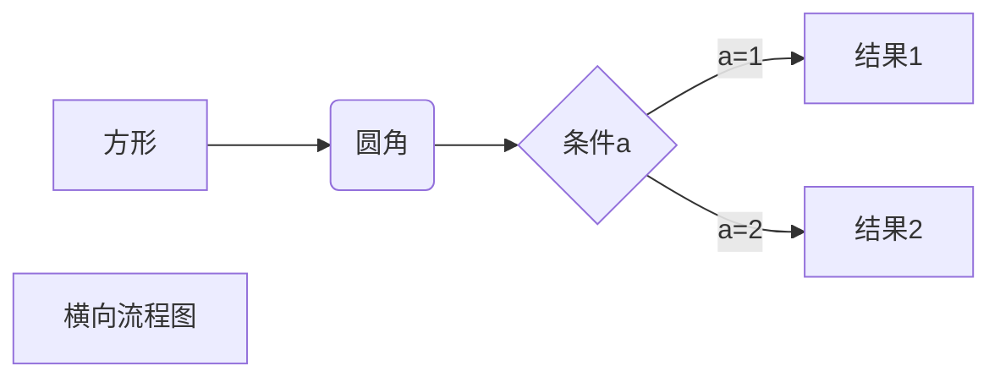

## Welcome to GitHub Pages

1. 第一步...

2. 第二步...

3. 第三步...

### [文字](1.html)

### 流程图

```mermaid
graph LR
A[方形] -->B(圆角)
    B --> C{条件a}
    C -->|a=1| D[结果1]
    C -->|a=2| E[结果2]
    F[横向流程图]
```
